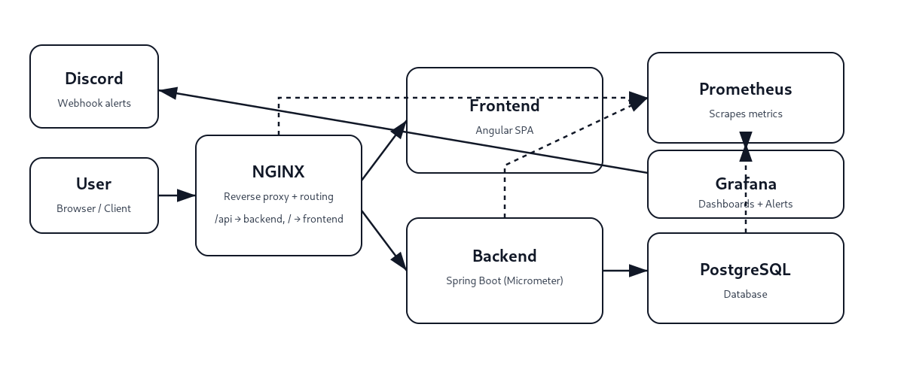
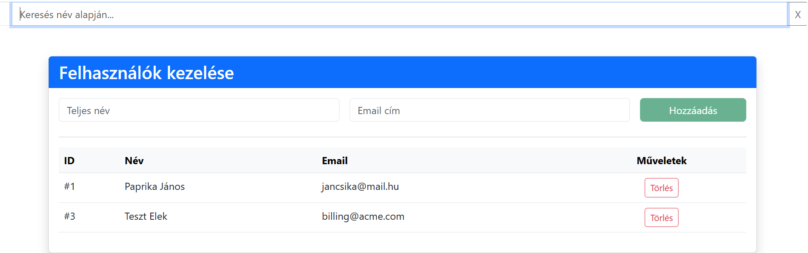
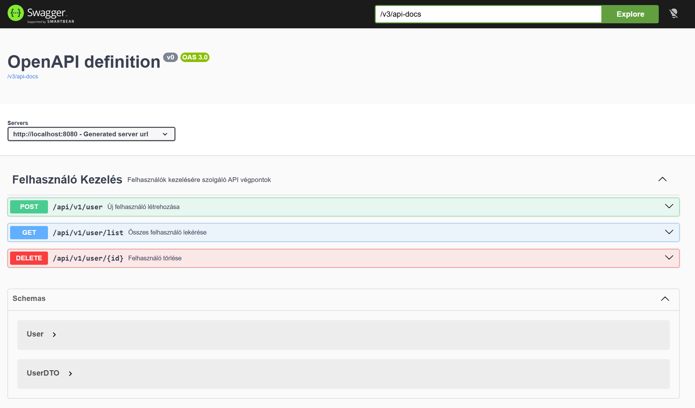
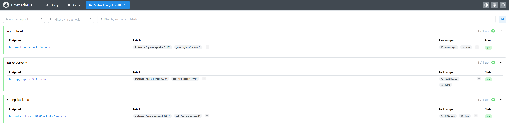
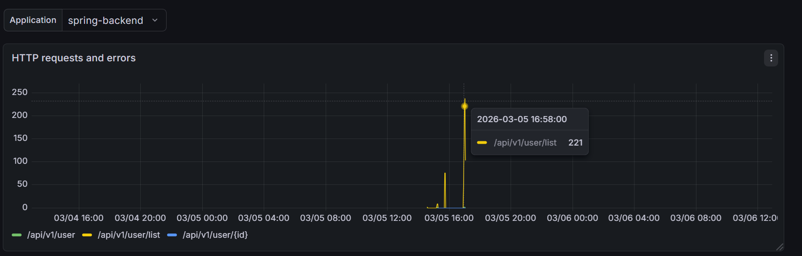
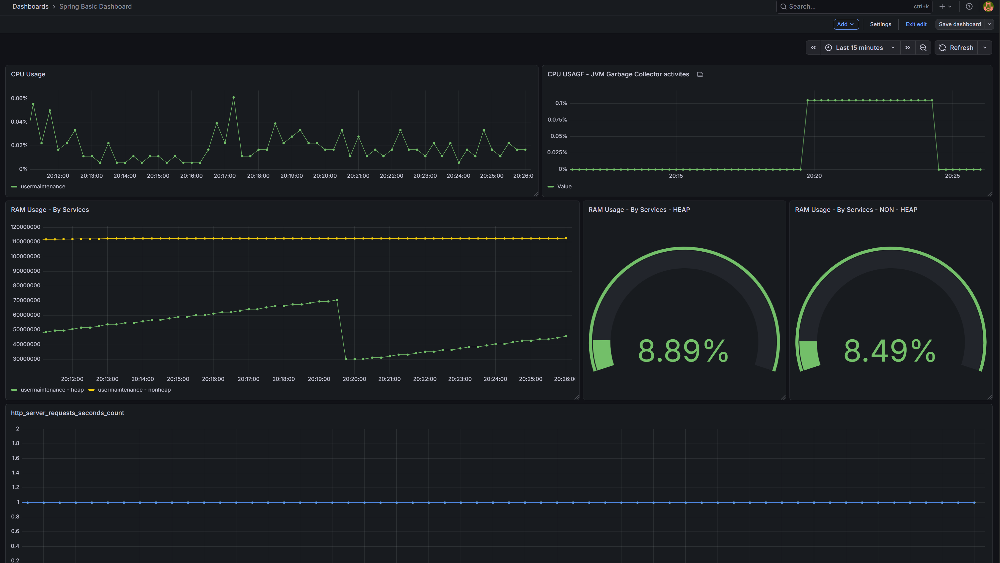
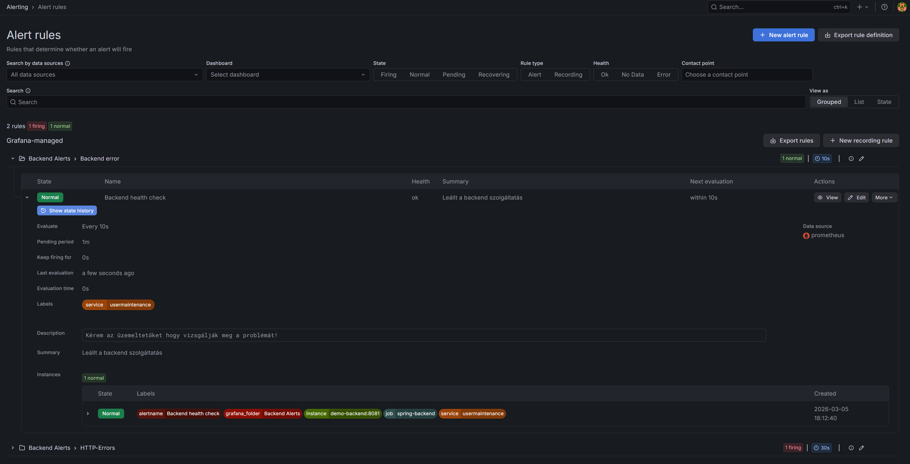
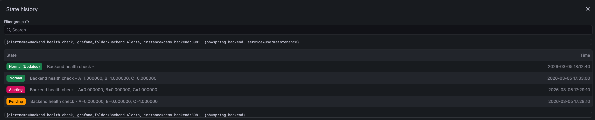

# Monitoring & Alerting Demo


Prometheus és Grafana alapú **monitoring és alerting rendszer** egy demo webalkalmazáshoz (Docker Compose).

---

## Tartalom

- [Projekt célja](#projekt-célja)
- [Architektúra](#architektúra)
- [Gyors indítás](#gyors-indítás)
- [Végpontok](#végpontok)
- [Prometheus konfiguráció](#prometheus-konfiguráció)
- [Grafana beállítás](#grafana-beállítás)
- [Dashboardok](#dashboardok)
- [Alerting](#alerting)
- [Dashboard & Alerting képernyőképek](#dashboard--alerting-képernyőképek)
- [Licenc](#licenc)

---

## Projekt célja

A projekt célja egy **teljes monitoring pipeline** bemutatása:

- metrikák gyűjtése (Spring Boot / NGINX / PostgreSQL exporterek)
- vizualizáció Grafanában (dashboardok)
- riasztás küldése kritikus esetben (Grafana → Discord)

---

## Architektúra



**Routing (NGINX):**
- `/api/*` → backend
- `/` → frontend

---

## Gyors indítás

```bash
docker-compose up --build
```

A parancs elindítja:
- frontend (Angular)
- backend (Spring Boot)
- PostgreSQL
- Prometheus
- Grafana
- NGINX + exporterek

---

## Végpontok

- **Grafana:** `http://localhost:3000`
- **Prometheus:** `http://localhost:9090`
- **Prometheus targets:** `http://localhost:9090/targets`

---

## Prometheus konfiguráció

A `prometheus.yml` scrape configjai:

```yaml
global:
  scrape_interval: 15s

scrape_configs:
  - job_name: 'spring-backend'
    metrics_path: '/actuator/prometheus'
    static_configs:
      - targets: ['demo-backend:8081']

  - job_name: 'nginx-frontend'
    static_configs:
      - targets: ['nginx-exporter:9113']

  - job_name: 'pg_exporter_v1'
    static_configs:
      - targets: ['pg_exporter:9630']
```

---

## Grafana beállítás

1. Nyisd meg: `http://localhost:3000`
2. Állítsd be a Prometheus datasource-t:

**Prometheus URL:**
```
http://prometheus:9090
```

---

## Dashboardok

A projekt több, kritikus dashboardot tartalmaz:

- **Backend Tomcat Threads** – Tomcat thread monitorozás
- **HTTP Requests with Errors** – request volumen + 5xx hibák
- **NGINX Exporter** – NGINX metrikák (grafana.com-ról letöltött diagram)
- **PostgreSQL Database** – DB erőforrások, sessionök, WAL, tranzakciók (grafana.com-ról letöltött diagram átalakítva Postgres 18-hoz és a pgsty/pg_exporter-hez)
- **Spring Basic Dashboard** – JVM memória/CPU/GC
- **Spring Boot Backend Status** – backend példányszám (up/down)

### Példa PromQL (HTTP hibák)

Összes request URI-nként:

```promql
sum(increase(http_server_requests_seconds_count{application="usermaintenance"}[5m])) by (uri)
```

5xx hibák:

```promql
sum(increase(http_server_requests_seconds_count{application="usermaintenance", status=~"5.."}[1m])) by (status)
```

---

## Alerting

### Contact point: Discord webhook

Grafana riasztásokat küld egy Discord csatornára webhookon keresztül.

### Alert rules

- **Backend error**  
  Riaszt, ha **nem fut** a backend (0 instance).  
  Feltétel: probléma **legalább 1 percig** fennáll.

- **HTTP errors**  
  Riaszt, ha a backend API **5xx** válaszokat ad.  
  Feltétel: probléma **legalább 1 percig** fennáll.

---

## Dashboard & Alerting képernyőképek
> Tipp: a képek a `assets/screenshots/` mappában vannak.
### Feladat / GUI

### Feladat / Swagger API dokumentáció


### Prometheus targets

### Grafana dashboards




### Grafana alerting



---

## Licenc

MIT – lásd: [LICENSE](LICENSE)
